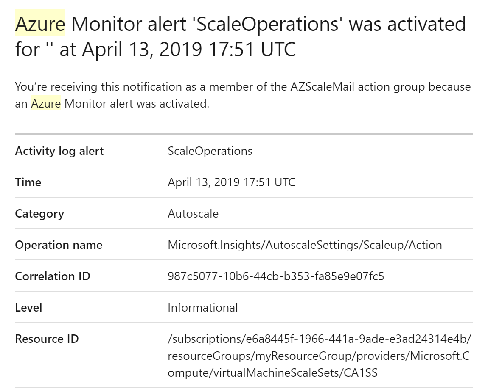
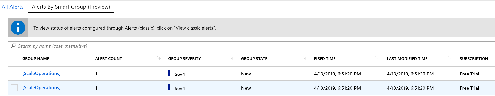
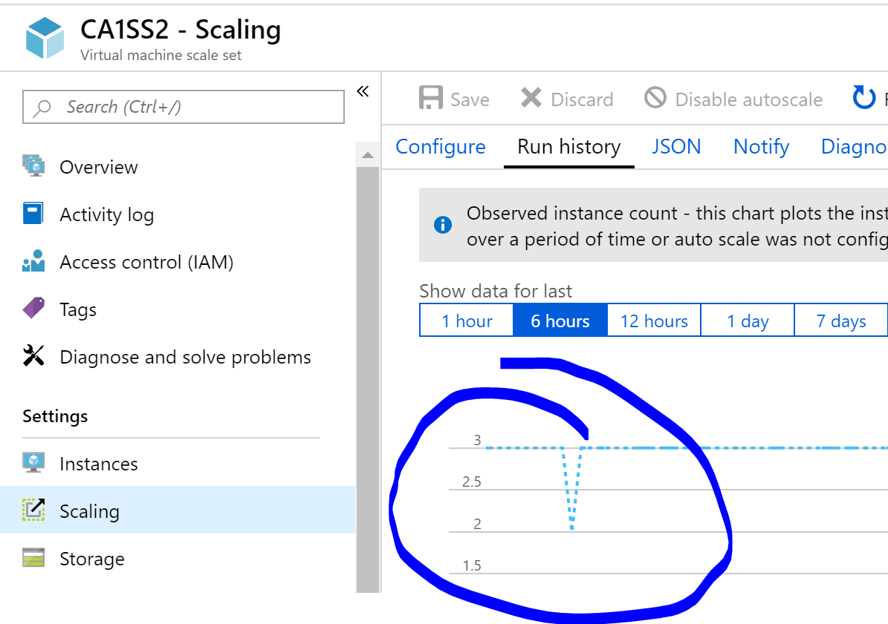

# Comparison Notes

| AZure | AWS |
|-------|-----|
| vNET| VPC |
| VM | Instance |
| AD | IAM |
| Scale Set | Auto Scale group |
| SendGrid | Simple Email Service |

Over all, AWS and Azure offer similar services. There is a comparative offering for everything I looked for. How they are implented and document does vary. I gravitated to the PowerShell module for Azure as i know PowerShell very well, for me the cmdlet structure was easy to understand, easier than the boto3 implementation in Python, while I accept that this is down to existing knowledge.

I did not fully implement the chaos monkey in a script but did walk through all of the functions tasks such as setting up an Azure VM Scale Set (VMSS) and configuring notification by email of changes to the scale set. Below are snippets of code I used while exploring Azure, a lot of it is from Microsoft tutorial found here: "https://docs.microsoft.com/en-us/azure/virtual-machines/windows/tutorial-create-vmss" updated for my own Azure configuration.

```powershell
# Install // compatible with cross platform PowerShell Core
PS C:> Install-Module -Name Az -AllowClobber
# Azure login
PS C:> Connect-AzAccount

# Azure Resource Groups are like VPC in AWS - a logical container for resources

# Distrbute VMs across fault tolerant hardware within a datacenter
PS C:> New-AzAvailabilitySet -Location "westeurope" -Name "myAvailabilitySet" -ResourceGroupName "myResourceGroupAvailability" -PlatformFaultDomainCount 2

# Get the number of VMs in current scale set
PS C:> $myScaleSet = (Get-AzVmss -ResourceGroupName myResourceGroup -VMScaleSetName CA1SS)
PS C:> $myScaleSet
0

# Set the number of VMs in the scale set with update-azvmss
PS C:> $myScaleSet.sku.capacity = 3
PS C:> Update-Azvmss -ResourceGroupName myResourceGroup -Name CA1SS -VirtualMachineScaleSet $myScaleSet

# Get the VM id's from the Scale Set
PS C:> $myVMs = Get-AzVmssVM -ResourceGroupName myResourceGroup -VMScaleSetName CA1SS

PS C:> $myVMs[0] | format-list
ResourceGroupName      : myResourceGroup
InstanceId             : 11
Sku                    : Microsoft.Azure.Management.Compute.Models.Sku
LatestModelApplied     : True
ProtectFromScaleIn     :
VmId                   : 471783aa-2e3c-45cd-8ab8-515838b866d1
InstanceView           :
HardwareProfile        : Microsoft.Azure.Management.Compute.Models.HardwareProfile
StorageProfile         : Microsoft.Azure.Management.Compute.Models.StorageProfile
AdditionalCapabilities :
OsProfile              : Microsoft.Azure.Management.Compute.Models.OSProfile
NetworkProfile         : Microsoft.Azure.Management.Compute.Models.NetworkProfile
DiagnosticsProfile     :
AvailabilitySet        :
ProvisioningState      : Succeeded
LicenseType            :
Plan                   :
Resources              : {}
Zones                  : {2}
Id                     : /subscriptions/e6a8445f-1966-441a-9ade-e3ad24314e4b/resourceGroups/myResourceGroup/providers/Microsoft.Compute/virtualMachineScaleSets/CA1SS/virtualMachines/11
Name                   : CA1SS2_11
Type                   : Microsoft.Compute/virtualMachineScaleSets/virtualMachines
Location               : northeurope
Tags                   : {}

PS C:> Remove-AzVM -Id $myVMs[0].vmId
# This should work but did not for me
 PS C:> Remove-AzVM -name $myVMs[0].name -Force -Confirm:$false -ResourceGroupName myResourceGroup
# Neither did this, but I know I'm in the right ball park.

# Scale Set - set number of VMs like an autoscale group / up to 1000 VMs if Azure platform image or 300 if a custome image
New-AzVmss `
  -ResourceGroupName "myResourceGroupScaleSet" `
  -Location "WestEurope" `
  -VMScaleSetName "myScaleSet" `
  -VirtualNetworkName "myVnet" `
  -SubnetName "mySubnet" `
  -PublicIpAddressName "myPublicIPAddress" `
  -LoadBalancerName "myLoadBalancer" `
  -UpgradePolicyMode "Automatic"

# Create a scale up rule to increase the number instances after 60% average CPU usage exceeded for a 5-minute period
$myRuleScaleUp = New-AzAutoscaleRule `
-MetricName "Percentage CPU" `
-MetricResourceId $myScaleSetId `
-Operator GreaterThan `
-MetricStatistic Average `
-Threshold 60 `
-TimeGrain 00:01:00 `
-TimeWindow 00:05:00 `
-ScaleActionCooldown 00:05:00 `
-ScaleActionDirection Increase `
-ScaleActionValue 1

# Apply the autoscale rules
Add-AzAutoscaleSetting `
  -Location $myLocation `
  -Name "autosetting" `
  -ResourceGroup $myResourceGroup `
  -TargetResourceId $myScaleSetId `
  -AutoscaleProfile $myScaleProfile
```

## Availabilty set != scale set but similar

Availability Sets are not the same as Scale sets, they cover different things. Scale sets are for capacity, scaling as required, availability is related to fault tolerance. Fault domains are verticle stacks of technology that are closely coupled such that if one goes down it could impact availability. Spreading instances over different fault domains tries to mitigate disruption caused by outages, but also I beleive managed down time. This allows the opperator to take down sections of the datacenter for updates and patches etc, with much less risk to the service as a whole.

## Monitoring and alerting is different but similar

I was able to set up triggers on any scale actions in Monitor - Alerts. It is possible to add email addresses to be notfied in the event of an action. As seen in the image below, the AZScaleMail group was notified.



### Free tier SendGrid - send email just like AWS SES

There is SendGrid which can send emails similarly to AWS SES, but more realistically you would send alerts through the monitoring tool where it is already integrated. The email services appear to be for email sending as a service usage versus notifications.

### Activity - Autoscaling

```powershell

PS C:> $myScaleSet = (Get-AzVmss -ResourceGroupName myResourceGroup -VMScaleSetName CA1SS2)
PS C:> $myScaleSet.sku.capacity = 3
PS C:> Update-Azvmss -ResourceGroupName myResourceGroup -Name CA1SS2 -VirtualMachineScaleSet $myScaleSet

PS C:> Get-AzVmssVM -ResourceGroupName myResourceGroup -VMScaleSetName CA1SS2

ResourceGroupName     Name   Location          Sku Capacity InstanceID ProvisioningState
-----------------     ----   --------          --- -------- ---------- -----------------
myResourceGroup   CA1SS2_0 westeurope Standard_B1s                   0         Succeeded
myResourceGroup   CA1SS2_2 westeurope Standard_B1s                   2         Succeeded
myResourceGroup   CA1SS2_5 westeurope Standard_B1s                   5         Succeeded


PS C:> Remove-AzVM -Id $myVMs[0].vmId -Force -Confirm:$false
OperationId :
Status      : Succeeded
StartTime   : 13/04/2019 20:22:05
EndTime     : 13/04/2019 20:22:05
Error       :
#Again this should work but it does not, it say it did but in the console nothing changes.

PS C:> Get-AzVmssVM -ResourceGroupName myResourceGroup -VMScaleSetName CA1SS2

ResourceGroupName     Name   Location          Sku Capacity InstanceID ProvisioningState
-----------------     ----   --------          --- -------- ---------- -----------------
myResourceGroup   CA1SS2_0 westeurope Standard_B1s                   0          Deleting
myResourceGroup   CA1SS2_2 westeurope Standard_B1s                   2         Succeeded
myResourceGroup   CA1SS2_5 westeurope Standard_B1s                   5         Succeeded
```

### It took hours to notice the missing instance

Likely because the VMs were not being exercised there was no impitus to scale back to 3 even though the default configuration was 3 instances. However when left overnight it did return to 3 instances at 4am as seen in the "Run History".




I do believe auto scaling would work for real events and that I am close to tuning the response time to resemble AWS more closely.